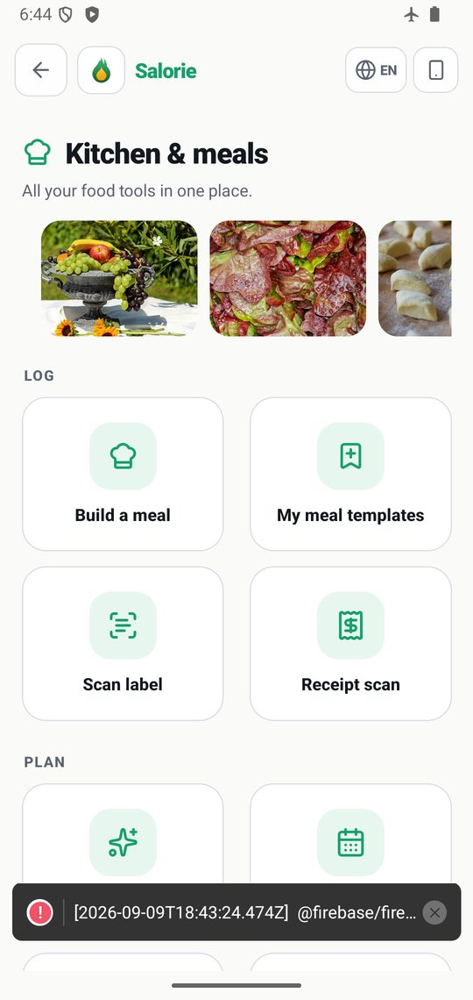
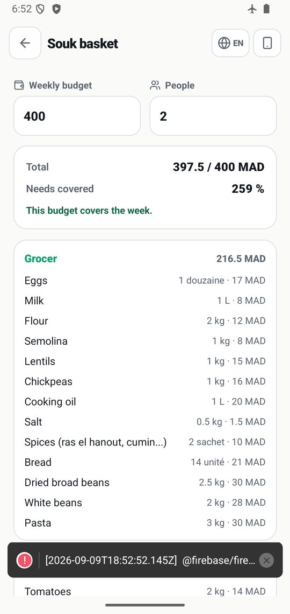
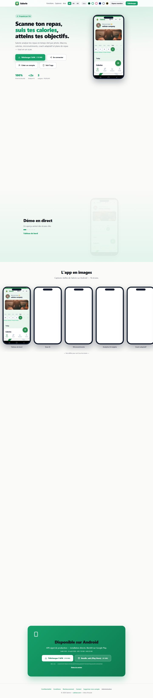
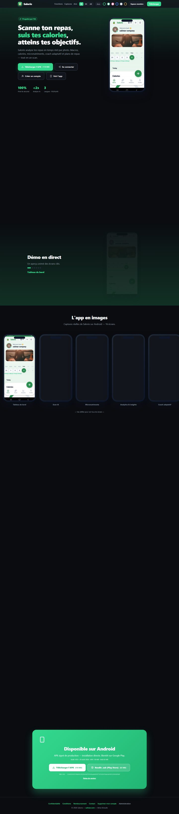
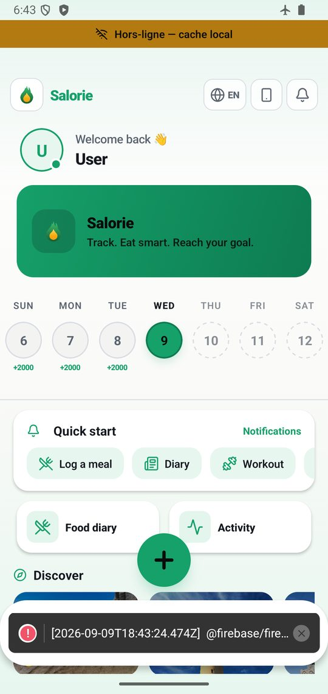

# Salorie

Suivi nutritionnel et sportif pour un public **marocain** : reconnaissance de
plats par photo, journal alimentaire, courses et défis, le tout en **français,
arabe et anglais**, et utilisable **hors ligne**.

Trois applications dans ce dépôt :

| | quoi | où |
|---|---|---|
| **mobile** | Expo / React Native, Android | `app/`, `lib/`, `components/` |
| **backend** | NestJS + Firestore + Redis (+ Mongo optionnel) | `backend/` |
| **web** | Next.js — landing publique, espace membre `/me`, back-office | `web/` |
| **vision** | classifieur d'aliments 172 classes | `food4k/` |

Production : [salorie.com](https://salorie.com) · [api.salorie.com](https://api.salorie.com) ·
serveur Hetzner `srv3`, déployé par GitHub Actions à chaque push sur `main`.

---

## Démarrer

```bash
npm install && npx expo start --dev-client     # mobile (Metro)
cd backend && npm install && npm run start:dev # API sur :3001
cd web && npm install && npm run dev           # web + admin sur :3000
```

Voir un écran mobile réellement tourner (émulateur x86_64, grâce hors-ligne,
lien profond) : `docs/` et l'historique de `metro.config.js`. **C'est la seule
manière de trouver certaines classes de défauts** — la section « Ce que la
lecture de code ne trouve pas » plus bas dit pourquoi.

---

# Audit complet — 9 septembre 2026

Tout ce qui suit est **mesuré**, pas estimé. Chaque chiffre se reproduit :

```bash
node scripts/auditer-cablage.js      # est-ce BRANCHÉ ?
node scripts/auditer-features.js     # qu'y a-t-il DERRIÈRE ?
npx jest && (cd backend && npx jest) && (cd web && npx jest)
```

## 1. L'état, en un tableau

| | mesure | état |
|---|---|---|
| Écrans mobiles | 107 (102 hors authentification) | |
| Écrans qu'aucun lien n'atteint | **0** | ✅ (était 3) |
| Routes API exposées | 79 | |
| Appels vers une route inexistante | **0** | ✅ |
| Drapeaux de fonctionnalité | 57 | ✅ (était 39) |
| Drapeaux qui ne commandent rien | **0** | ✅ |
| Écrans lourds sans interrupteur | **0** | ✅ (était 33) |
| Tests | **794** (590 mobile · 189 backend · 15 web) | ✅ tous verts |
| Écrans touchés par un test | 45 / 102 | ⚠️ à améliorer |
| `tsc` et ESLint | 0 erreur | ✅ |
| Vulnérabilités (prod) | mobile 0/21 · backend 0/4 · web **1**/1 | ⚠️ voir §4 |
| targetSdk | 36 | ✅ au-dessus de l'exigence Play |

## 2. Fonctionnalités

**102 écrans** hors authentification, en six familles. Chacun est joignable
depuis un hub ou un lien profond — le vérificateur de câblage n'en trouve
aucun d'orphelin — et chacun peut être éteint à distance, sauf ceux dont
l'extinction casserait l'application (§3).

**Nutrition** — journal, scan photo (172 classes), code-barres, étiquette,
ticket de caisse, composeur de repas, repas types, plan journée, plan IA,
nutriments, Nutri-Score, substitutions, mode restaurant, frigo → recettes,
recettes locales, import MyFitnessPal/Yazio, liste de courses,
**panier du souk** (combien manger avec le budget qu'on a — en dirhams, par étal).

**Sport** — séances, plans, compteur de répétitions, course GPS, courses
virtuelles, défis (dont AR), duo, sports collectifs, réservation de terrain,
médailles, ligues, Strava.

**Santé** — Health Connect, constantes, sommeil, humeur, hydratation
intelligente, composition corporelle, jumeau métabolique, TDEE adaptatif,
préparation, export de rapport.

**Social** — mur, amis, groupes, chat temps réel (WebRTC + TURN), partage,
parrainage, marketplace.

**Maroc** — Ramadan (horaires de jeûne, budget Suhoor/Iftar, hydratation),
sadaqa, halal au scan, prix du souk, plats locaux.

**Compte** — 3 langues, 6 thèmes, RTL, hors-ligne, Premium (RevenueCat).




## 3. Ce qui a été corrigé aujourd'hui

### `GET /flags` n'existait pas
`lib/featureFlags.ts` décrivait depuis des mois un endpoint avec cache Redis et
repli « dernier bon ». Le mot « flags » apparaissait **zéro fois** dans
`backend/src` ; l'URL rendait 404. Rien ne cassait — le mobile retombait sur
Firestore — mais l'économie de quota annoncée (N clients → 1 lecture/minute)
n'avait jamais lieu. Construit, déployé, vérifié en production :

```
$ curl https://api.salorie.com/flags
{"flags":{"fasting":true,"meal-plan":true},"source":"cache"}
```

### Trois fonctionnalités finies sans porte d'entrée
`/panier-souk` (+ sa librairie, ses données de prix et son test **qui passait
au vert tous les jours**), `/race-chat`, et surtout `/meal-plan` — seul
écrivain de `saveMealPlan`, ce qui rendait `/meal-plan-history`, lui
atteignable, **vide par construction**.

### 33 écrans lourds sans interrupteur
Un drapeau ne suffit pas : `navFlags` masque la *tuile*, `useScreenGate` ferme
l'*écran*. Il fallait les deux. 33 gardes posés, 18 clés ajoutées — et le piège
inverse traité : `NON_EXTINGUIBLES` interdit d'en poser un sur `/privacy`
(exigence Google Play), sur le journal alimentaire (c'est l'application) ou sur
un onglet (le bouton resterait dans la barre). Un test l'empêche.

### Un badge qui se montrait à tout le monde
Le calcul de série dépensait un « gel » en tombant au bout de l'historique,
sans rien ponter. `freezes` valait donc **au moins 1 pour toute série non
vide** : cinq jours parfaits affichaient « 🛡️ protégé », et un seul jour
manqué affichait « ×2 ». Corrigé dans les deux copies du calcul.

### Le bouton de téléchargement le plus visible du site
Il pointait sur le build du **9 juin**, alors que la section plus bas utilisait
la release dynamique. Pire : la ligne d'à côté affichait la taille du build
*courant*. Et l'asset de juin n'ayant jamais été supprimé, le lien répondait
200 — un contrôle de liens morts l'aurait déclaré sain.

## 4. Sécurité

**Ce qui est en place**, vérifié : HSTS un an, `X-Frame-Options: DENY`,
`nosniff`, `Referrer-Policy: no-referrer`, `Permissions-Policy` limitée à notre
propre origine. Les 7 routes du back-office redirigent vers `/login` sans
session ; `/ml/vision-tiers` rend 401 sans jeton ; `/flags/invalidate` rend 403
sans clé admin. Secrets masqués dans les logs (`masquage-secrets.spec.ts`).
Règles Firestore testées sous émulateur.

**Ce qui reste** :

| | sévérité | fix |
|---|---|---|
| `next@14.2.35` | **critique** | Next 16 (montée **majeure**) |
| 21 hautes (mobile), 4 (backend) | haute | montées majeures |

⚠️ **Sur la critique Next, la mesure honnête** : son vecteur nommé est un déni
de service via `images.remotePatterns` de l'Image Optimizer. **Aucun
`remotePatterns` n'est configuré ici**, et `next/image` n'est utilisé que dans
un fichier. L'exposition par ce vecteur précis est donc nulle. La montée reste
à faire — mais la présenter comme une brèche ouverte serait faux.

## 5. Risque de rejet Google Play

Les permissions du **binaire de production** (`aapt2 dump permissions` sur
l'APK signé, pas sur la source) :

✅ **Pas de `SYSTEM_ALERT_WINDOW`** — `blockedPermissions` fonctionne. Le
manifeste de *debug* la porte, mais c'est le menu du dev-client ; le binaire
livré ne l'a pas. La distinction compte : cette permission est une cause
classique de rejet.
✅ `READ_EXTERNAL_STORAGE maxSdkVersion=32`, `WRITE_EXTERNAL_STORAGE
maxSdkVersion=28` — plafonnées, donc hors de la politique Photos et Vidéos.
✅ Santé en **lecture seule**, quatre types déclarés un par un.
✅ `targetSdk 36`.

**Ce qui reste à faire, et qui n'est pas du code** :

1. **20 testeurs pendant 14 jours** en test fermé — exigence Google pour tout
   nouveau compte développeur particulier. C'est le blocage principal.
2. **Formulaire Health Connect** : déclaration d'usage + lien vers la politique
   de confidentialité, à remplir dans la console.
3. **Divulgation bien visible** pour `RECORD_AUDIO` (journal vocal) et
   `ACCESS_FINE_LOCATION` (course GPS) — un écran d'explication avant la
   demande système, pas seulement la boîte de dialogue Android.
4. **Formulaire « Sécurité des données »** : doit correspondre à ce qui est
   réellement collecté, y compris par Sentry et RevenueCat.
5. **Clé RevenueCat de production** + paywall configuré : sans elle, le bouton
   Premium ne fait rien.

## 6. Design

Six thèmes (`obsidian`, `ivory`, `blush`, `ocean`, `platinum`, `gold`), jetons
centralisés dans `constants/tokens.ts`, un workflow CI dédié au système de
design. Trois langues avec **RTL manuel** : l'application désactive
délibérément `I18nManager.forceRTL` — sinon changer de langue redémarre
l'application — donc chaque `flexDirection: 'row'` est retourné à la main via
`isRTL`. Deux tests veillent dessus.





## 7. Reconnaissance de plats

172 classes (Food-101 + 71 plats marocains), 288 px, servies par une cascade
qui va **du plus rapide et gratuit au plus lourd et payant** : téléphone →
serveur auto-hébergé → Cloudflare → Ollama → 6 fournisseurs bon marché → 2
chers. L'ordre est un tri stable par coût puis latence, couvert par 14 tests.

Corpus marocain porté de 336 à **13 338 images** ; 1 697 images mal étiquetées
retirées. Le modèle en service rend **40 réponses fausses contre 202** au
départ.

## 8. Ce que la lecture de code ne trouve pas

Trois des défauts corrigés aujourd'hui **ne pouvaient pas** être vus autrement
qu'en faisant tourner l'application ou en interrogeant la production :

- Le panier du souk affichait son interface en anglais et ses cinquante
  produits en français. Le code était juste ; c'est la **donnée** qui n'avait
  que deux langues sur trois. Ni `tsc`, ni 794 tests, ni la relecture.
- `GET /flags` répondait 404 en production alors que le mobile l'appelait à
  chaque démarrage. Visible avec un `curl`, invisible dans le dépôt.
- Le bouton de téléchargement pointait sur un build de juin **en répondant
  200**.

C'est aussi pourquoi deux mesures de cet audit ont d'abord **menti dans le sens
qui rassure**, et sont documentées comme telles dans `scripts/auditer-features.js` :
« 99 écrans sur 102 couverts par un test » (le lien passait par `theme` et
`i18n`, importés partout — le vrai chiffre est 45) et « presque aucun écran
n'appelle le backend » (les écrans passent par `lib/`, la mesure s'arrêtait un
saut trop tôt).

## 9. À faire

**Bloquant pour la publication** — les 20 testeurs / 14 jours ; la clé
RevenueCat de production.

**Important** — monter Next en 16 (la seule critique) ; monter la couverture
au-delà de 45/102, en commençant par `/challenge` (1 229 lignes, neuf modules
métier, aucun test) ; faire relire par un locuteur natif les 108 noms français
identiques à l'anglais et les 51 noms arabes manquants du catalogue d'aliments.

**Le vrai gain suivant** — le pipeline de correction des photos utilisateur est
prêt et **vide**. C'est de là que viendra le prochain progrès du modèle, pas
d'un moteur de recherche.

**À enlever** — rien. Les trois écrans « morts » n'étaient pas des ruines mais
des fonctionnalités finies sans porte d'entrée : elles sont branchées, pas
supprimées.

---

## Licence et déploiement

Déploiement automatique sur `main` (`deploy-backend-web.yml`). APK et AAB
signés publiés en release GitHub (`android-release.yml`), et proposés au
téléchargement sur la landing — qui résout **dynamiquement** la dernière
release `build-<versionCode>`, un test interdisant désormais tout lien figé.
